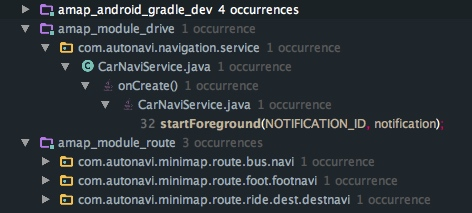

---

layout: post
title:  "Android O适配调研"
date:   2017-04-12 1:05:00
catalog:  true
tags:

   - Android O
    
   
---

# 什么是 Android O？

Android O 是下一版本的 Android 系统，它优化了电源及性能，并提供了多种全新方式来扩展您的应用，主要变化如下：

- 通知渠道
- 画中画
- 自动填充
- 自适应图标

## Android 计划概览
O Developer Preview 从 2017 年 3 月 21 日开放下载，到向 AOSP 和 OEM 提供最终的 Android O 公开版本时停止使用，最终版本预计将于 2017 年第三季度发布。

在开发阶段的各个关键里程碑，为开发和测试环境提供更新。每个更新都包括 SDK 工具、预览版系统映像、模拟器、API 参考和 API 差异,里程碑列表如下。


- Preview 1（初始版本，alpha）
- Preview 2（增量更新，beta）
- Preview 3（最终 API 和官方 SDK，在 Play 中发布）
- Preview 4（接近最终版本系统映像，用于最终测试）
- 向 AOSP 和生态系统发布最终版本

从上能够看出，此次发布的DP1（开发者预览版）的更新版本DP2在五到六月份之间，而DP1和DP2都主要面向开发者，发现兼容性问题，体验反馈新特性，此时的系统镜像自身还有很多稳定性问题，还不适合日常使用；

DP3、DP4已经到七月份，提供了最终的API和官方SDK，在此基础上可以做完整的兼容性测试和基于新特性开发新功能。最终的Android O版本发布则定在了第三季度。


## 适配指南

Android新版本的限制与变化主要分成两方面，一是影响所有app的，二是影响面向新版本app的（主要是targetSdkVersion指向新版本）。后者的适配还好，一般的应用不会非常快的修改targetSdkVersion；而前者是实实在在的需要立即着手跟进的。因此适配分为两个方面：兼容性适配和Android O新功能的使用。

## 兼容性适配
验证您的应用是否能够在新版本平台上全功能运行。在此阶段，不需要使用新的 API，也不需要更改应用的 targetSdkVersion，但可能需要进行一些细微的更改。流程如下：


### 关键行为变更
Android O 向 Android 平台引入了一些变化，即便不对 targetSdkVersion 做任何变动，仍可能影响应用的行为或令其根本无法运行。因此，需要参考下列变更，来做出相应适配修改并测试。

#### 1. 后台执行限制

- Android O 为提高电池寿命而引入的变更之一是：当应用进入[已缓存状态](https://developer.android.com/guide/topics/processes/process-lifecycle.html)时，如果没有活动的组件，系统将解除应用具有的所有wakelock。

  **可能受影响的业务代码：**

    ```
    public class MsgBoxBadgeReceiver extends BroadcastReceiver {
        public static final String ACTION_BADGE = "com.autonavi.minimap.action.Badge";
        private PowerManager.WakeLock mWakeLock;
    ```
- 使用 `NotificationManager.startServiceInForeground()`方法启用foreground Service，旧方法(`android.app.Service#startForeground`)不再有效。

 **可能受影响业务代码**：




#### 2.网络连接和安全相关变化

 - 平台不再支持SSLv3
 - HttpsURLConnection在HTTPS链接建立时，不再自动切换到早期TLS协议版本重试 
 - WebView 对象将在多进程模式下运行，网页内容在独立的进程中处理，将运行在独立的进程中，此进程与包含应用的进程相隔离，以提高安全性。
 - 如果之前执行的 connect() 方法失败，send(java.net.DatagramPacket) 方法将会引发 SocketException

#### 3.隐私策略变化

#####（1）标识符ANDROID_ID

  - ANDROID_ID 不再是设备中所有应用共享的，而是每个应用获取到的都不一样，应用软件包名称、签名、用户和设备的每个组合都具有唯一的 ANDROID_ID 值。
  - 卸载后重新安装也不会发生变化；
  - 如果软件包签名密钥是因为更新而发生改变，那么，ANDROID_ID 的值不会改变。
  - 只有在设备恢复出厂设置，Android ID 的值才会改变。
  
#####（2）其他  
  
  - 查询 net.hostname 系统属性返回的结果为空；
  - 无法再假定 APK 驻留在名称以 -1 或 -2 结尾的目录中。应用应使用 [sourceDir](https://developer.android.com/reference/android/content/pm/ApplicationInfo.html#sourceDir) 获取此目录，而不能直接使用目录格式。 


#### 4.未捕获异常的处理
  
  如果在应用自定义的`Thread.UncaughtExceptionHandler`未将未捕获异常传递给default UncaughtExceptionHandler,此时应用不会被终止，从Android O开始，系统将会记录异常的stacktrace。建议自定义的UncaughtExceptionHandler实现都把异常传递给默认的UncaughtExceptionHandler。
  
#### 5.Contacts provider使用统计变更

不再提供联系人邮件或电话联系过的精确次数信息，而是仅提供近似值，但系统内部仍会保留精确值。受影响的查询参数：
<ul>
    <li>
      <code><a href="https://developer.android.com/reference/android/provider/ContactsContract.ContactOptionsColumns.html#TIMES_CONTACTED">TIMES_CONTACTED</a></code>
    </li>
    <li>
      <code><a href="https://developer.android.com/reference/android/provider/ContactsContract.DataUsageStatColumns.html#TIMES_USED">TIMES_USED</a></code>
    </li>
    <li>
      <code><a href="https://developer.android.com/reference/android/provider/ContactsContract.ContactOptionsColumns.html#LAST_TIME_CONTACTED">LAST_TIME_CONTACTED</a></code>
    </li>
    <li>
      <code><a href="https://developer.android.com/reference/android/provider/ContactsContract.DataUsageStatColumns.html#LAST_TIME_USED">LAST_TIME_USED</a></code>
    </li>
  </ul>
  
  
#### 6.应用快捷方式变更

- 快捷方式的创建
  
从Android O开始`com.android.launcher.action.INSTALL_SHORTCUT `变成私有的隐式action，不能再使用广播的方式创建快捷方式；改用 ShortcutManager的 requestPinShortcut()方法代替。

- 使用ACTION_CREATE_SHORTCUT创建的快捷方式可以被ShortcutManager统一管理，

**可能受影响业务代码**

应用内快捷方式创建目前都采用`com.android.launcher.action.INSTALL_SHORTCUT `方式。

#### 7.Alert Window显示变化 

使用SYSTEM_ALERT_WINDOW 权限，创建的如下类型的window：

- TYPE_PHONE
- TYPE_PRIORITY_PHONE
- TYPE_SYSTEM_ALERT
- TYPE_SYSTEM_OVERLAY
- YPE_SYSTEM_ERROR

在Android O系统上都将显示在TYPE_APPLICATION_OVERLAY类型的窗口之下。而targetSdkVersion为android O的应用直接使用TYPE_APPLICATION_OVERLAY显示你的Window，这样你的弹框可能还是在别人的弹窗之下。

#### 8.其他变更

- 蓝牙：Android O 对 ScanRecord.getBytes() 方法检索的数据长度变更；
- 键盘导航：使应用支持实体键盘导航，主要适用于chrome系统运行Android应用；

- 集合类的处理：AbstractCollection.removeAll() 和 AbstractCollection.retainAll()当参数为空时，抛出NullPointerException。
  >ArrayList重写了该方法，使用Vector需要注意，可能受影响的业务：
  `public class KoalaDownloadModel extends Vector<KoalaDownloadEntity>`

- 本地化和国际化：调用 Currency.getDisplayName(null) 会引发 NullPointerException

## 新功能使用

