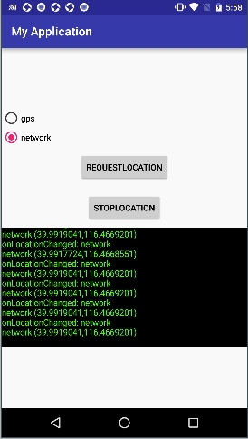
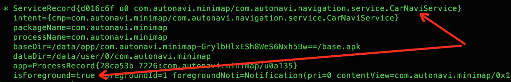

## 一 什么是 Android O？

Android O 是下一版本的 Android 系统，它优化了电源及性能，并提供了多种全新方式来扩展您的应用，主要新功能如下：

- 通知渠道
- 画中画
- 自动填充
- 自适应图标

## 二 Android 计划概览
O Developer Preview 从 2017 年 3 月 21 日开放下载，到向 AOSP 和 OEM 提供最终的 Android O 公开版本时停止使用，最终版本预计将于 2017 年第三季度发布。

在开发阶段的各个关键里程碑，为开发和测试环境提供更新。每个更新都包括 SDK 工具、预览版系统映像、模拟器、API 参考和 API 差异,里程碑列表如下。


- Preview 1（初始版本，alpha）
- Preview 2（增量更新，beta）
- Preview 3（最终 API 和官方 SDK，在 Play 中发布）
- Preview 4（接近最终版本系统映像，用于最终测试）
- 向 AOSP 和生态系统发布最终版本

从上能够看出，此次发布的DP1（开发者预览版）的更新版本DP2在五到六月份之间，而DP1和DP2都主要面向开发者，发现兼容性问题，体验反馈新特性，此时的系统镜像自身还有很多稳定性问题，不适合日常使用；

DP3、DP4已经到七月份，提供了最终的API和官方SDK，在此基础上可以做完整的兼容性测试和基于新特性开发新功能。最终的Android O版本发布则定在了第三季度。


## 三 适配指南

Android新版本的限制与变化主要分成两方面，一是影响所有app的，二是影响面向新版本app的（主要是targetSdkVersion指向新版本）。后者的适配还好，一般的应用不会非常快的修改targetSdkVersion；而前者是实实在在的需要立即着手跟进的。因此适配分为两个方面：兼容性适配和targetSdkVersion='O'的适配。

### 3.1 兼容性适配流程
验证您的应用是否能够在新版本平台上全功能运行。在此阶段，不需要使用新的 API，也不需要更改应用的 targetSdkVersion，但可能需要进行一些细微的更改。流程如下：


### 3.2 更新targetSdkVersion的适配流程

如果构建应用时设置了适用于 Android O 的 targetSdkVersion，应该注意特定的平台变化。即便不实现 Android O 中的新功能，其中的一些变化仍可能严重影响应用的行为或令其根本无法运行。


## 四 主要适配项

以下适配项默认是兼容性适配(影响所有版本target API)，target为O的适配项会专门注明。

### 1. 后台执行限制

 Android支持多个应用和服务可以同时运行，同时运行的app越多，系统的负担越大，如果同时在后台运行应用或服务，这会对系统造成更大负担，进而可能导致用户体验下降；Android O从这个维度重新定义了前后台应用，并对后台应用的后台Service做了一些限制。

#### 1.1 前后台应用定义

Android O定义了一套区分前后台应用的标准(与内存管理对后台应用的定义不同)，如果满足以下任一条件，均视为前台应用：
 
 - app运行着一个可见的Activity，包括pause但可见的状态；
 - app运行着一个前台service；
 - app被其他运行在前台的应用通过bindService或调用content provider的方式关联，如：
   - IME
   - Wallpaper service
   - Notification listener
   - Voice or text service
以上几条均不满足，视为后台应用。

**针对后台应用和服务，Android O从如下几个方面做了优化：**

#### 1.2  后台执行限制

#### 1.2.1 wakelock
 
 Android O 为提高电池寿命，当应用进入[已缓存状态](https://developer.android.com/guide/topics/processes/process-lifecycle.html)时，如果没有活动的组件，系统将release应用具有的所有wakelock。
 
 **适配策略：**
 
 全局只有`com.autonavi.minimap.life.msgbox.MsgBoxBadgeReceiver#onReceive`方法在申请锁，onReceive方法执行时，amap属于前台应用，因此不会受影响。

#### 1.2.2 后台Service限制

> 注：该限制仅适用于target为 Android O 的应用。 针对 API 级别 25 或更低级别的应用不受影响。

**API变更：**

**（1）后台Service运行限制：**
 
  
 前台应用可以任意创建和运行前后台Service，前台应用切换为后台应用后，仍然有几分钟的窗口期可以创建运行Service，窗口期结束，应用进入空闲状态，这时系统会停止该应用的后台Service，就像Service.stopSelf()被调用了一样。

特定场景下，后台应用会被加入到一个临时白名单中持续几分钟时间，白名单中的应用可以没有限制的启动和运行自己的后台Service，这些场景主要是指后台应用处理一个用户可见的task的场景，如：

- 接收到一条广播；
- 点击notification触发的PendingIntent，目标app切换到前台。

**适配策略：**

Amap全局常驻一个前台Service，使Amap始终被当作前台应用?
 
**（3）创建前台Service方式：**

在Android O之前，创建前台Service的步骤是：先创建一个后台Service，再调用 `Service.startForeground()`方法将其变为前台Service，由于Android O中，因为后台应用无法启动运行后台Service，该方式将失效；因此，Android O 引入了一种全新的方法，即 NotificationManager.startServiceInForeground()。 

**适配策略：**

Amap中受影响的前台Service：

```
com.autonavi.navigation.service.CarNaviService;
com.autonavi.minimap.route.foot.footnavi.FootNaviService;
com.autonavi.minimap.route.ride.dest.destnavi.DestNaviService;
com.antfortune.freeline.FreelineService;
com.antfortune.freeline.FreelineService.InnerService;
```
以上几个Service都调用了`Service.startForeground()`把自己变成前台Service。其他后台Service需要根据下边的原则来决定是否把自己变成前台Service：

（1）如果应用在后台，想要创建一个前台Service，直接使用 NotificationManager.startServiceInForeground() 方法；
  
```
if (Build.VERSION.SDK_INT >= Build.VERSION_CODES.O) {
                mNotificationManager.startServiceInForeground(new Intent(this,
                        LocationUpdatesService.class), NOTIFICATION_ID, getNotification());
            } else {
                startForeground(NOTIFICATION_ID, getNotification());
            }
```

实测，startForeground仍然可以继续使用，猜测Android O正式版会把该api标记为Deprecated.

（2）如果应用在后台时Service仍然需要运行，把他设为前台服务。 例如，播放音频的服务始终应为前台服务；

（3）如果后台Service的工作非必须立即执行，使用计划作业，如：JobScheduler等；

（4）根据情况，推迟后台操作，直到应用回到前台。


### 2 Broadcast注册限制

 > 注：该限制仅适用于target为 Android O 的应用。 针对 API 级别 25 或更低级别的应用不受影响。

**API变更：**

**（1）变更原因：**
如果app注册了一个broadcas监听，每次目标广播被发送时，app的receiver都会消耗资源。如果多个app都注册了基于系统事件的广播，触发广播的系统事件会导致多个app快速地连续消耗资源，从而降低用户体验。为了缓解这一问题，Android 7.0（API 级别 25）对广播施加了一些限制，如后台优化中所述。 Android O 让这些限制更为严格。


 
 **(2)具体变更：**
 
 - targetSdkVersion为O的app，无法在manifest中注册隐式广播，例如，ACTION_PACKAGE_REPLACED 就是一种隐式广播，因为它将发送到注册的所有侦听器，让后者知道设备上的某些软件包已被替换；ACTION_MY_PACKAGE_REPLACED 就是显式广播，它只会发送到软件包已被替换的应用。
 - 应用可以继续在manifest中注册显式广播。
 - 应用可以在运行时使用 Context.registerReceiver() 为任意广播（隐式或显式）注册接收器。

有一部分隐式广播例外，仍然可以在manifest中注册，参见[隐式广播例外](https://developer.android.com/preview/features/background-broadcasts.html)。

**适配策略：**

Amap中受影响的receiver：

```
com.autonavi.minimap.app.update.InstallListener；
com.autonavi.minimap.offline.receiver.SdCardReceiver;
com.autonavi.minimap.app.WakeupReceiver;
com.taobao.accs.EventReceiver;
com.taobao.agoo.AgooCommondReceiver
```
修改策略如下：

（1）通过 Context.registerReceiver() 注册隐式receiver；

（2）使用JobScheduler 获得等价功能（如果存在），如 ACTION_POWER_CONNECTED 和`JobInfo.Builder.setRequiresCharging(boolean)`


### 3.后台位置限制

#### 3.1 API变更

**（1） 变更内容：**
为降低功耗，无论app的targetSDKVersion是多少，Android O Developer Preview 都会对后台应用检索用户当前位置的频率进行限制。作为起点，只允许后台应用每小时接收几次位置更新。
 

受影响的API如下：

- **[Fused Location Provider](https://developers.google.com/android/reference/com/google/android/gms/location/FusedLocationProviderApi) (FLP)和Geofencing**，都是Google Api；
- **GNSS Measurements 和 GNSS Navigation Message**，当应用位于后台时，注册的用于接收 GnssMeasurement 和 GnssNavigationMessage 输出的回调会停止执行。目前Amap未用到;
- **Location Manager**，根据Android O中的位置更新频率通知后台应用位置更新（一小时只有几次）。


#### 3.2 定位实测

根据Android O对后台定位的限制，和定位组杨磊同学设计了以下两个测试场景（以下结论分别经过Android O的dp1和dp2测试）：

##### 3.2.1 场景一：gps定位和网络定位

官方文档未明确说明后台定位频率限制，具体针对那种定位方式，该场景分别单独测试gps定位和网络定位，demo界面如下：



关键代码如下：

```
locationManager.requestLocationUpdates(provider, 1000, 0, this);
```

测试结果如下：

```
gps定位方式：通过按Home键，切后台后，长时间收不到位置更新；

网络定位方式：切后台后，仍然能收到位置更新，频率无明显变化；

结论：Android O后台定位限制只针对Gps定位方式，对网络定位(network provider)无影响；
另外，从@杨磊了解到，Amap网络定位依赖于网络,wifi扫描,基站信息等，不依赖LocationManager里面的network provider功能，因此该限制只对纯gps后台定位有影响。
```


##### 3.2.2 场景二：后台应用位置更新频率

测试无网络情况下，对Amap使用gps导航的影响

```
Amap版本：v8.0.6.2065
测试机型：Honor v8   Android 7.0
        小米3C      Android 6.0.1
        Nexus 5x   Android O DP1
        Google Pixel Android O DP1
        
测试步骤：step1：四部手机均开启gps，关闭网络(排除网络定位干扰)，设置导航起点：首开广场，目的地：望京凯德茂，断网，实际步行路线如下图红色箭头所示；
        step2：位置1==>位置2，四部手机都前台导航，测试结果：四部手机都可实时位置更新，并正常播报TTS语音提示。和预期一致；
        step3:位置2==>位置3，四部手机导航都切后台(Home键)，测试结果：
        （1）两部Android O手机都没有TTS语音播报；
         (2) 步行至位置3后，切换高德地图到前台：两部非Android O位置已更新到位置3，两部Android O位置还停留在位置2，等几秒钟才更新到位置3.
         
结论：Android O上，使用gps导航，Amap切后台后，位置更新频率大幅降低；

```


>需要注意的地方:不能用本地包复现上述实验，因为本地包会运行一个前台Service:FreelineService，即使按Home键，Amap也被当做前台应用。


#### 3.3 适配策略

受影响比较大的是定位功能，目前Amap中的定位功能由定位sdk提供，以amap私有进程（com.autonavi.minimap:locationservice）形式运行着一个后台Service（AMapService）。

**对Amap的影响**：

**驾车导航：**：由于驾车导航过程中，会开启一个前台Service，`com.autonavi.navigation.service.CarNaviService`,因此切后台也可以正常使用；



**步行导航：**
步行导航也在代码中启动了前台Service，但好像启动前台Service失败，仍然是一个后台Service，无网络切后台情况下使用，受影响较大。`com.autonavi.minimap.route.foot.footnavi.FootNaviService`;


**骑行导航：**

骑行导航过程，没有任何前台Service，无网络切后台情况下使用，受影响较大。

官方以下几种适配策略：

- 将应用变为前台应用；
- 使用passive位置监听器，它可以在有前台应用以更快频率请求位置更新时提高自己的位置更新的接收频率。

分析这两条建议：

（1）第一条可以通过创建全局前台Service方式实现，可使amap被看作是前台应用，后台Service不会轻易被系统stop，接收位置更新的频率也不会受影响(目前Amap并没有常驻前台Service)。

（2）使用被动位置监听器，如果没有前台应用请求位置更新，则无效。

#### 3.4 发现的问题

测试过程发现以下几个问题，文档没有提及：

（1）Android O后台定位限制只针对Gps定位方式，对网络定位(network provider)无影响；

（2）后台定位频率的限制，对mockgps方式测试无效；

（3）Android O DP1 gps定位较慢，不稳定，有时候甚至定位失败；

（4）demo在纯gps后台定位时，位置更新频率大幅降低，但如果前台有其他应用在请求gps定位，demo也会正常收到位置更新。


### 4.隐私策略变化

#### 4.1 标识符ANDROID_ID

  - ANDROID_ID 不再是设备中所有应用共享的，而是每个应用获取到的都不一样，应用软件包名称、签名、用户和设备的每个组合都具有唯一的 ANDROID_ID 值。
  - 卸载后重新安装也不会发生变化；
  - 如果软件包签名密钥是因为更新而发生改变，那么，ANDROID_ID 的值不会改变。
  - 只有在设备恢复出厂设置，Android ID 的值才会改变。
  

  
#### 4.2 仅适用于target为 Android O 的隐私策略变更
  
  - 系统属性 net.dns1、net.dns2、net.dns3 和 net.dns4 不再可用，此项变更可加强平台的隐私性。
  
  - 从 Android O 开始，不再支持 Build.SERIAL（过时），此字段将返回一个未定义的值。使用 Build.getSerial() 代替，该方法要求具有 READ_PHONE_STATE 权限。Amap中目前只有一处需要修改：`com.autonavi.minimap.util.UserIdentifierTool.DeviceInfo#getSerialNumber`。
    
 

#### 4.3 其他  
  
  - 查询 net.hostname 系统属性返回的结果为空；
  - 无法再假定 APK 驻留在名称以 -1 或 -2 结尾的目录中。应用应使用 [sourceDir](https://developer.android.com/reference/android/content/pm/ApplicationInfo.html#sourceDir) 获取此目录，而不能直接使用目录格式。 
  

  
  
### 5.App shortcuts

**API变更：**

- 快捷方式的创建
  
从Android O开始`com.android.launcher.action.INSTALL_SHORTCUT `变成私有的隐式action，不要再使用广播的方式创建快捷方式(亲测仍可用，安全起见，做兼容处理)；改用 ShortcutManager的 requestPinShortcut()方法代替（目前不稳定，launcher会崩溃）。

使用步骤如下：

（1）使用` isRequestPinShortcutSupported()`
判断当前launcher是否支持快捷方式创建；

（2）使用下列两种方式之一创建一个 ShortcutInfo对象；
    - 如果是一个已经存在的快捷方式，ShortcutInfo只要包含快捷方式的ID就可以了；
    - 如果是新建一个快捷方式，ShortcutInfo需要包含一个ID，一个intent和一个short label。
    
（3）调用requestPinShortcut()，如果需要，传递一个 PendingIntent对象，用来接收创建成功的通知；

> 如果用户不允许创建快捷方式，app不会收到任何回调。
创建完成后，可以使用 updateShortcuts()更新快捷方式。

流程代码如下：

```
ShortcutManager mShortcutManager =
        context.getSystemService(ShortcutManager.class);

if (mShortcutManager.isRequestPinShortcutSupported()) {
    // Assumes there's already a shortcut with the ID "my-shortcut".
    // The shortcut must be enabled.
    ShortcutInfo pinShortcutInfo = ShortcutInfo.Builder(context, "my-shortcut");

    // Create the PendingIntent object only if your app needs to be notified
    // that the user allowed the shortcut to be pinned. Note that, if the
    // pinning operation fails, your app isn't notified. We assume here that the
    // app has implemented a method called createShortcutResultIntent() that
    // returns a broadcast intent.
    Intent pinnedShortcutCallbackIntent =
            createShortcutResultIntent(pinShortcutInfo);

    // Configure the intent so that your app's broadcast receiver gets
    // the callback successfully.
    PendingIntent successCallback = PendingIntent.createBroadcast(context, 0,
            pinnedShortcutCallbackIntent);

    mShortcutManager.requestPinShortcut(pinShortcutInfo,
            successCallback.getIntentSender());
}
```

    
**适配策略：**

Amap中受影响的类（使用sendBroadcast创建快捷方式）：

```
com.autonavi.common.utils.ShortCutUtil;
com.autonavi.minimap.drive.taxi.presenter.TaxiOrderHistoryPresenter#createShortcut;
com.autonavi.map.setting.presenter.AddNaviShortcutPresenter#createShortCut;
com.autonavi.minimap.basemap.save.page.SaveEditPointPage#addOrDeleteShortCut;
com.autonavi.minimap.basemap.save.util.SavePointUtils#addShortCutToDesktop;
com.autonavi.minimap.route.common.util.RouteUtil#createRealTimeBusShortCut;
```
修改策略：根据运行时Android版本，采取sendBroadcast或ShortcutManager.requestPinShortcut
创建快捷方式。


### 6.悬浮窗显示 

新增窗口类型：`TYPE_APPLICATION_OVERLAY`,常量值：2038，Z轴层级在所有Activity窗口之上，但在系统窗口（状态栏，输入法）之下。

以下几种类型过时，使用`TYPE_APPLICATION_OVERLAY`代替：

- ~~TYPE_PHONE~~
- ~~TYPE_PRIORITY_PHONE~~
- ~~TYPE_SYSTEM_ALERT~~
- ~~TYPE_SYSTEM_OVERLAY~~
- ~~TYPE_SYSTEM_ERROR~~

应用内之前使用` SYSTEM_ALERT_WINDOW `权限创建的以上几种类型的窗口，在Android O上运行分为两种情况：

- targetSdkVersion < Android O,在Android O系统上都将显示在TYPE_APPLICATION_OVERLAY类型的窗口之下。
- 而targetSdkVersion为android O的应用应该直接使用TYPE_APPLICATION_OVERLAY类型显示悬浮窗，上面提到的几种type过时。

使用`TYPE_APPLICATION_OVERLAY`需要注意的地方：

1. 该类型的悬浮窗层级始终位于系统窗口之下，如状态栏和输入法窗口等；
2. 系统有可能移动或调整窗口大小，以得到更好的视觉效果；
3. 用户可以通过设置关闭应用的悬浮窗功能。

**适配策略**：

（1）Amap中目前只有一处用了TYPE_PHONE类型的弹窗，而且是leakcanary发生内存泄漏时的弹窗(com.autonavi.minimap.PerformanceBugInfo)，对正式环境无影响；

（2）Android O以后应用弹窗统一使用`TYPE_APPLICATION_OVERLAY`类型。

### 7.权限变化
 > 注：该限制仅适用于target为 Android O 的应用。 针对 API 级别 25 或更低级别的应用不受影响。

在 Android O 之前，如果应用在运行时请求并获得一个运行时权限，系统会错误地将在manifest注册的其他同组权限也一起授予该应用。

对于针对 Android O 的应用，此行为已被纠正。系统只会授予应用明确请求的权限。但是，一旦用户为应用授予某个权限，则所有后续对该权限组中权限的请求都将被自动批准。


**适配策略：**

申请运行时权限时，列出操作用到的所有权限(同组不能省略)如一个操作要用到READ_EXTERNAL_STORAGE和WRITE_EXTERNAL_STORAGE两个权限，Android O以下版本写法：

```
PermissionUtil.CheckSelfPermission(page.getActivity(), 
new String[]{Manifest.permission.READ_EXTERNAL_STORAGE},
callback);//Android O以下，如果申请通过，同时获得SD卡的读写权限，
```
Android O以上版本，需要用到的完整权限列表：

```
PermissionUtil.CheckSelfPermission(page.getActivity(), 
new String[]{Manifest.permission.READ_EXTERNAL_STORAGE,
Manifest.permission.WRITE_EXTERNAL_STORAGE},
callback);
```


### 8.未捕获异常的处理
  
  从Android O开始，系统将会记录异常的stacktrace;需要在应用自定义的`Thread.UncaughtExceptionHandler`未将未捕获异常传递给default UncaughtExceptionHandler,否则应用不会被终止。参考以下代码：
  
  
```
  class MyExceptionHandler implements Thread.UncaughtExceptionHandler {

        @Override
        public void uncaughtException(Thread t, Throwable e) {
            handleException();//处理exception
            if (t.getThreadGroup() != null) {
                t.getThreadGroup().uncaughtException(t, e);//交给默认exceptionhandler
            }

        }
    }
    
```

**适配策略：**

全局只有`com.autonavi.minimap.LogUploadUtil#init`方法中一处调用了`Thread.setDefaultUncaughtExceptionHandler`方法，已交给默认UncaughtExceptionHandler处理，整体没有影响。

### 9.网络连接和安全相关变化

 - Android O不再支持SSLv3
 - HttpsURLConnection在HTTPS链接建立时，不再自动切换到早期TLS协议版本重试 
 - WebView 将在多进程模式下运行，在独立进程中运行webview渲染程序，此进程与包含应用的进程相隔离，以提高安全性。（实测h5页面未发现兼容性问题，开发者选项中有多进程webview开关）
 - 如果之前执行的 connect() 方法失败，send(java.net.DatagramPacket) 方法将会引发 SocketException


### 10.Contacts provider使用统计变更

不再提供联系人邮件或电话联系过的精确次数信息，而是仅提供近似值，但系统内部仍会保留精确值。受影响的查询参数：
<ul>
    <li>
      <code><a href="https://developer.android.com/reference/android/provider/ContactsContract.ContactOptionsColumns.html#TIMES_CONTACTED">TIMES_CONTACTED</a></code>
    </li>
    <li>
      <code><a href="https://developer.android.com/reference/android/provider/ContactsContract.DataUsageStatColumns.html#TIMES_USED">TIMES_USED</a></code>
    </li>
    <li>
      <code><a href="https://developer.android.com/reference/android/provider/ContactsContract.ContactOptionsColumns.html#LAST_TIME_CONTACTED">LAST_TIME_CONTACTED</a></code>
    </li>
    <li>
      <code><a href="https://developer.android.com/reference/android/provider/ContactsContract.DataUsageStatColumns.html#LAST_TIME_USED">LAST_TIME_USED</a></code>
    </li>
  </ul>

> 该变更对Amap无影响。

### 11.其他变更

- 蓝牙：Android O 对 ScanRecord.getBytes() 方法检索的数据长度变更,对Amap无影响；

- 集合类的处理：AbstractCollection.removeAll() 和 AbstractCollection.retainAll()当参数为空时，抛出NullPointerException；
  >ArrayList重写了该方法不受影响，使用Vector需要注意
  
Amap中有一处使用了Vector，`com.autonavi.minimap.offline.koala.model.KoalaDownloadModel;`

- 本地化和国际化：调用 Currency.getDisplayName(null) 会引发 NullPointerException，目前对Amap无影响。

## 五 Android O新功能

### 1 通知

在 Android O 中，我们已重新设计通知，以便为管理通知行为和设置提供更轻松和更统一的方式。这些变更包括：

- 通知渠道：Android O 引入了通知渠道，不同类型通知可以采用不同chanel，每个chanel可以单独设置通知方式。渠道创建代码：
  
```
NotificationManager mNotificationManager =
        (NotificationManager) getSystemService(Context.NOTIFICATION_SERVICE);
// The id of the channel.
String id = "my_channel_01";
// The user visible name of the channel.
CharSequence name = getString(R.string.channel_name);
int importance = NotificationManager.IMPORTANCE_LOW;
NotificationChannel mChannel = new NotificationChannel(id, name, importance);
// Configure the notification channel.
mChannel.enableLights(true);
// Sets the notification light color for notifications posted to this
// channel, if the device supports this feature.
mChannel.setLightColor(Color.RED);
mChannel.enableVibration(true);
mChannel.setVibrationPattern(new long[]{100, 200, 300, 400, 500, 400, 300, 200, 400});
mNotificationManager.createNotificationChannel(mChannel);
new Notification.Builder(getApplicationContext(), mChannel.getId())
                 .setContentTitle(title)
                 .setContentText(body)
                 .setSmallIcon(getSmallIcon())
                 .setAutoCancel(true);
```

- 通知超时：新增Notification.Builder.setTimeout() 接口，可指定超时时间，超时后自动取消通知。当然，也可以提前调用取消接口清除通知；
- 通知清除：新增NotificationListenerService.onNotificationRemoved()接口，注册该回调可以区分通知是由用户清除，还是由应用移除；

- 消息样式：MessagingStyle类新增addHistoricMessage() 方法，通过添加历史消息为会话提供上下文。

### 2 自动填充框架

Android O 通过引入自动填充框架，简化了登录和表单类的填写工作。在用户选择接受自动填充之后，新老应用都可使用自动填充框架。

您可以采取某些措施，优化您的应用使用此框架的方式。如需了解详细信息，请参阅[自动填充框架概览](https://developer.android.com/preview/features/autofill.html)。

> 系统服务，需要在设置->应用和通知->默认应用->自动填充应用中开启


### 3 画中画模式

Android O 允许以画中画 (PIP) 模式启动 Activity。PIP 是一种特殊的多窗口模式，最常用于视频播放。目前，PIP 模式可用于 Android TV，而 Android O 则让该功能可进一步用于其他 Android 设备。

Activity 处于 PIP 模式时，它会处于pause状态，但仍应继续显示内容。


**几个注意点：**

1. 要使用PIP模式的Activity需要在manifest中设置`android:supportsPictureInPicture=true`属性；
2. Activity 处于 PIP 模式时，生命周期处于pause状态，但仍应继续显示内容；
3. 相关API：
   - Activity新增进入画中画API：`enterPictureInPictureMode(mPictureInPictureArgs);`,使用方式如下：
   
     ```
float aspectRatio = (float) mMovieView.getWidth() / mMovieView.getHeight();//must be between 0.500000 and 2.350000
        mPictureInPictureArgs.setAspectRatio(aspectRatio);
//进入画中画
enterPictureInPictureMode(mPictureInPictureArgs);
```

   - Activity新增画中画状态回调API：`onPictureInPictureModeChanged(boolean isInPictureInPictureMode)`;
   - 新增`android.app.PictureInPictureArgs`类型，用于封装Activity对画中画设置控制参数；
    

   - 新增`android.app.RemoteAction`类型，用于和远程画中画交互；
   
   
   使用方式如下：
   
   
```
final PendingIntent intent = PendingIntent.getBroadcast(MainActivity.this,
                requestCode, new Intent(ACTION_MEDIA_CONTROL)
                        .putExtra(EXTRA_CONTROL_TYPE, controlType), 0);
        final Icon icon = Icon.createWithResource(MainActivity.this, iconId);
        actions.add(new RemoteAction(icon, title, title, intent));

        mPictureInPictureArgs.setActions(actions);

       
// 随时可调，如果当前非画中画模式，新参数将会在下次调用#enterPictureInPictureMode进入画中画模式时生效。
                setPictureInPictureArgs(mPictureInPictureArgs);
```

  
  
  


### 4 字体支持

#### Fonts in XML

Android O之前，自定义字体需要放在asset中，通过运行时加载，设置给TextView。从Android开始，支持font文件以resource形式放在res/font/文件夹，访问方式同普通资源文件： @font/myfont, or R.font.myfont。


#### Retrieving system fonts

新增两个API：

`FontManager.getSystemFonts()`:检索所有系统自带字体信息，返回类型FontConfig。

`FontConfig`: 包含系统字体信息.

使用方法如下：


```
FontManager fontManager = context.getSystemService(FontManager.class);
FontConfig systemFontsData = fontManager.getSystemFonts();
```

### 5 Adaptive Icons

Android O引入自适应launcher icon，在不同oem手机显示不同形状和视觉效果。不同oem手机提供不同形状的mask，系统用这个mask来渲染icon，生成的icon也会用在设置界面和分享界面。

 

通过定义两张图片（前景与背景）制定你的桌面图标外观，图片必须是没有阴影的 PNG 格式。


两张背景图大小必须是108*108，中间72px为可视区域，四周剩余36px，系统会用来生成视觉特效(如视差和跳动)：

 

#### 创建自适应icon
分为两步：

1. 创建资源文件：`res/mipmap-anydpi/ic_launcher.xml`，内容如下：

```
<adaptive-icon>
    <background android:drawable="@color/ic_background"/>
    <foreground android:drawable="@mipmap/ic_foreground"/>
</adaptive-icon>
```
2. 在manifest中引用：
   ```
   <application
    …
    android:icon="@mipmap/ic_launcher"
       …>
  </application>
   ```

### 6 WebView APIs

Android O提供了几个API管理webview对象，以提高稳定性和安全性：

#### Version API

从Android7.0开始，Android系统允许用户在开发者选项中切换当前webview的实现；Android O提供了获取当前webview实现信息的API，可用来分析定位一些webview相关的error，相关代码如下：


```
PackageInfo webViewPackageInfo = WebView.getCurrentWebViewPackage();
Log.d(TAG, "WebView version: " + webViewPackageInfo.versionName);
```

#### Google Safe Browsing API

> What is Safe Browsing?
> Safe Browsing is a Google service that lets client applications check URLs against Google's constantly updated lists of unsafe web resources. Examples of unsafe web resources are social engineering sites (phishing and deceptive sites) and sites that host malware or unwanted software. Come see what's possible.

为了提供更安全的浏览体验，可以配置webview支持安全浏览，启用该功能后，当用户浏览不安全网站时，webview会弹出一个警告。启用方法如下，在manifest中配置如下meta-data：


```
<manifest>
    <meta-data android:name="android.webkit.WebView.EnableSafeBrowsing"
               android:value="true" />
    ...
    <application> ... </application>
</manifest>

```

#### webview渲染进程异常结束回调

WebviewClicent.onRenderProcessGone,当因为系统内存不足或webview渲染进程自己crash导致进程终止，都会执行这个回调，让开发者自己处理。

**处理原则**：

（1）原来的webview不能被复用，必须从
view hierarchy中移除这个webview并destory；

（2）如果webview加载某个特殊页面时发生crash，再次创建新的webview加载该页面，仍然可能再次crash。

使用方法如下：


```
/**
* 1 通知host application webview的渲染进程终止，多个webview可能关联在同一个渲染进程，所有关联的webview都会收到此回调；
* 2 参数中的webview不能被继续使用，应该从view hierarchy移除，并清除所有对该webview的引用；
* 3 为了测试，可以通过执行webview.loadUrl("chrome://crash"),查看chrome最近崩溃信息。
* 4 返回值：true，通知系统这个终止可以被处理，继续执行；
*          false，应用无法处理，如果渲染进程是因为内存问不足被终止，则宿主application也会被系统杀掉；如果渲染进程是因为内部crash被终止，则宿主application也会crash。
**/
public class MyRendererTrackingWebViewClient extends WebViewClient {
    private WebView mWebView;

    @Override
    public boolean onRenderProcessGone(WebView view,
            RenderProcessGoneDetail detail) {
        if (!detail.didCrash()) {
            // 渲染进程因为系统内存不足被杀掉，开发者可以在这里通过创建一个新的webview实例恢复执行
            Log.e("MY_APP_TAG", "System killed the WebView rendering process " +
                    "to reclaim memory. Recreating...");

            if (mWebView != null) {
                ViewGroup webViewContainer =
                        (ViewGroup) findViewById(R.id.my_web_view_container);
                webViewContainer.removeView(mWebView);
                mWebView.destroy();
                mWebView = null;
            }

            // 此处，原来的webview实例已经被释放销毁，可以安全地重新初始化的webview实例了
            
            return true; // 通知系统要继续执行
        }

        // 渲染进程内部原因导致crash
        Log.e("MY_APP_TAG", "The WebView rendering process crashed!");

       
        // 通知系统无法处理，宿主app会crash
        return false;
    }
}

```


#### 参考


[https://developer.android.com/preview/api-overview.html](https://developer.android.com/preview/api-overview.html)


