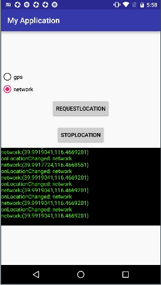
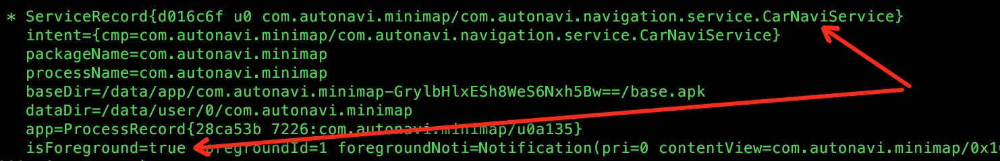
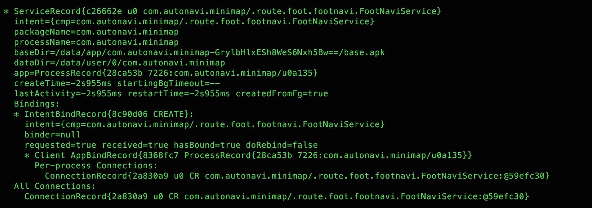

### 3.后台位置限制

#### 3.1 API变更

**（1） 变更内容：**
为降低功耗，无论app的targetSDKVersion是多少，Android O Developer Preview 都会对后台应用检索用户当前位置的频率进行限制。作为起点，只允许后台应用每小时接收几次位置更新。
 

受影响的API如下：

- **[Fused Location Provider](https://developers.google.com/android/reference/com/google/android/gms/location/FusedLocationProviderApi) (FLP)和Geofencing**，都是Google Api；
- **GNSS Measurements 和 GNSS Navigation Message**，当应用位于后台时，注册的用于接收 GnssMeasurement 和 GnssNavigationMessage 输出的回调会停止执行。目前Amap未用到;
- **Location Manager**，根据Android O中的位置更新频率通知后台应用位置更新（一小时只有几次）。


#### 3.2 定位实测

根据Android O对后台定位的限制，和定位组杨磊同学设计了以下两个测试场景（以下结论分别经过Android O的dp1和dp2测试）：

##### 3.2.1 场景一：gps定位和网络定位

官方文档未明确说明后台定位频率限制，具体针对那种定位方式，该场景分别单独测试gps定位和网络定位，demo界面如下：



关键代码如下：

```
locationManager.requestLocationUpdates(provider, 1000, 0, this);
```

测试结果如下：

```
gps定位方式：通过按Home键，切后台后，长时间收不到位置更新；

网络定位方式：切后台后，仍然能收到位置更新，频率无明显变化；

结论：Android O后台定位限制只针对Gps定位方式，对网络定位(network provider)无影响；
另外，从@杨磊了解到，Amap网络定位依赖于网络,wifi扫描,基站信息等，不依赖LocationManager里面的network provider功能，因此该限制只对纯gps后台定位有影响。
```


##### 3.2.2 场景二：后台应用位置更新频率

测试无网络情况下，对Amap使用gps导航的影响

```
Amap版本：v8.0.6.2065
测试机型：Honor v8   Android 7.0
        小米3C      Android 6.0.1
        Nexus 5x   Android O DP1
        Google Pixel Android O DP1
        
测试步骤：step1：四部手机均开启gps，关闭网络(排除网络定位干扰)，设置导航起点：首开广场，目的地：望京凯德茂，断网，实际步行路线如下图红色箭头所示；
        step2：位置1==>位置2，四部手机都前台导航，测试结果：四部手机都可实时位置更新，并正常播报TTS语音提示。和预期一致；
        step3:位置2==>位置3，四部手机导航都切后台(Home键)，测试结果：
        （1）两部Android O手机都没有TTS语音播报；
         (2) 步行至位置3后，切换高德地图到前台：两部非Android O位置已更新到位置3，两部Android O位置还停留在位置2，等几秒钟才更新到位置3.
         
结论：Android O上，使用gps导航，Amap切后台后，位置更新频率大幅降低；

```


>需要注意的地方:不能用本地包复现上述实验，因为本地包会运行一个前台Service:FreelineService，即使按Home键，Amap也被当做前台应用。


#### 3.3 适配策略

受影响比较大的是定位功能，目前Amap中的定位功能由定位sdk提供，以amap私有进程（com.autonavi.minimap:locationservice）形式运行着一个后台Service（AMapService）。

**对Amap的影响**：

**驾车导航：**：由于驾车导航过程中，会开启一个前台Service，`com.autonavi.navigation.service.CarNaviService`,因此切后台也可以正常使用；



**步行导航：**
步行导航也在代码中启动了前台Service，但好像启动前台Service失败，仍然是一个后台Service，无网络切后台情况下使用，受影响较大。`com.autonavi.minimap.route.foot.footnavi.FootNaviService`;




**骑行导航：**

骑行导航过程，没有任何前台Service，无网络切后台情况下使用，受影响较大。

官方以下几种适配策略：

- 将应用变为前台应用；
- 使用passive位置监听器，它可以在有前台应用以更快频率请求位置更新时提高自己的位置更新的接收频率。

分析这两条建议：

（1）第一条可以通过创建全局前台Service方式实现，可使amap被看作是前台应用，后台Service不会轻易被系统stop，接收位置更新的频率也不会受影响(目前Amap并没有常驻前台Service)。

（2）使用被动位置监听器，如果没有前台应用请求位置更新，则无效。

#### 3.4 发现的问题

测试过程发现以下几个问题，文档没有提及：

（1）Android O后台定位限制只针对Gps定位方式，对网络定位(network provider)无影响；

（2）后台定位频率的限制，对mockgps方式测试无效；

（3）Android O DP1 gps定位较慢，不稳定，有时候甚至定位失败；

（4）demo在纯gps后台定位时(未使用被动位置更新)，位置更新频率大幅降低，但如果前台有其他应用在请求gps定位，demo也会正常收到位置更新。

