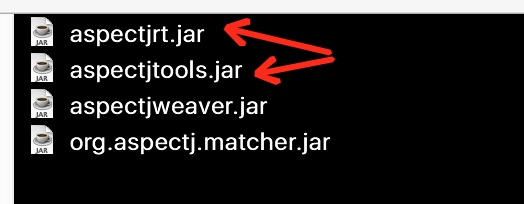

---

layout: post
title:  "漫谈AOP开发初探之AspectJ的用法"
date:   2017-08-30 1:05:00
catalog:  true
tags:

   - AOP
   - AspectJ
   
   
       
   
---

## 一、为什么需要AOP技术

AOP 是一个很成熟的技术。
假如项目中有方法A、方法B、方法C……等多个方法，
如果项目需要为方法A、方法B、方法C……这批方法增加具有通用性质的横切处理。
 
下图可以形象的说明具有通用性质的横切处理的思想：


**在以前传统的做法是**
 

1. 先定义一个Advice方法，该方法实现这个通用性质的横切处理。
2. 打开方法A、方法B、方法C……的源代码修改，使得方法A、方法B、方法C……去调用Advice方法。

客户电话： 为每个方法都增加日志。

客户电话： 为每个方法前都增加权限控制。

客户电话： 为每个方法都加……

….

如果使用AOP，可以做到程序员无需修改方法A、方法B、方法C……，但又可以为方法A、方法B、方法C增加调用Advice方法。

**面向切面编程（AOP）是作为面向对象编程（OOP）的补充**:

AOP框架具有如下两个特征：

1. 各步骤之间的良好隔离性。
2. 源代码无关性。

## 二、AOP的功能

保证程序员不修改方法A、方法B、方法C……的前提下，可以为方法A、方法B、方法C……增加通用处理。

AOP的本质：依然要去【修改】方法A、方法B、方法C……

—— 只是这个修改由AOP框架完成，程序员不需要改。

AOP要求去修改，到底怎么去修改方法A、方法B、方法……

**AOP的实现方式有两种**：

1. AOP框架在编译阶段，就对目标类进行修改，得到的class文件已经是被修改过的。生成静态的AOP代理类（生成*.class文件已经被改掉了，需要使用特定的编译器）。以AspectJ为代表 —— 静态AOP框架。
2. AOP框架在运行阶段，动态生成AOP代理（在内存中动态地生成AOP代理类），以实现对目标对象的增强。它不需要特殊的编译器。以Spring AOP为代表。—— 动态AOP框架。
 
上面两种，哪种性能更好？很明显静态的AOP框架更好。
下面我们进入AspectJ的学习.


## 三、实战AspectJ

AspectJ是一个基于Java语言的AOP框架，提供了强大的AOP功能，其他很多AOP框架都借鉴或采纳其中的一些思想。

1. 下载和安装AspectJ
    
    下载地址：[http://www.eclipse.org/aspectj/downloads.php](http://www.eclipse.org/aspectj/downloads.php)
    - 运行、下载得到的安装JAR包。
      ```
      java -jar /Users/guangjie.peng/development/aspectj-1.8.10.jar
      ```
      接下来，会自动检测JAVA_HOME,安装目录需要手动选择，一路Next；
 - 添加~/development/aspectj/bin到环境变量，配置完毕后输入terminal输入ajc，验证是否配置成功，该命令位于bin目录下。
 - 添加lib下的两个jar到classpath：
   
mac上添加到classpath的方法是：把jar包复制到`/Library/Java/Extensions`目录下。
    
    
2. 使用AspectJ
   
- step 1 编写如下java源文件：
   
```
   package com.example.aspectj;

/**
 * Created by guangjie.peng on 17/8/30.
 */

public class AspectTest {
    public static void main (String[] args){
       System.out.println("execute main methid!!");
    }
}
   
```

  -  step 2 编写aspect如下：

```   
public aspect AuthAspectj {
        // execution(* com.example.aspectj.*.*(..)执行 任意返回值 该包下的任意类的任意方法形参不限
        before():execution(* com.example.aspectj.*.*(..)){
// 对原来方法进行修改、增强。
        System.out.println("----------模拟执行权限检查----------");
        }
}
   
```

- step 3 编译：

```
cd com/example/aspectj/
 ajc -d *.java
 java com.example.aspectj.AspectTest
```

得到输出如下： 
 
```
 ----------模拟执行权限检查----------
execute main method!!

```  
   
以上是一个aspectj的入门，更多语法可以参考官网教程。

本文参考：[http://www.cnblogs.com/lihuidu/p/5802662.html](http://www.cnblogs.com/lihuidu/p/5802662.html)


